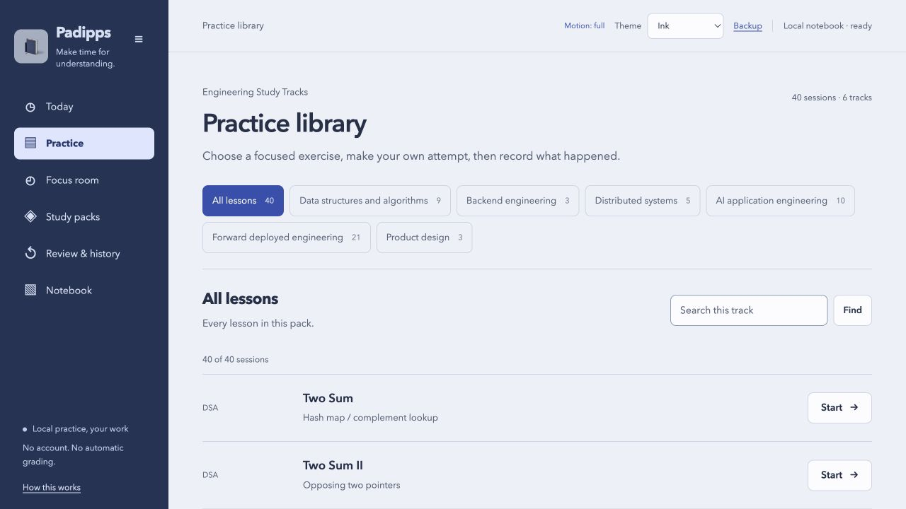
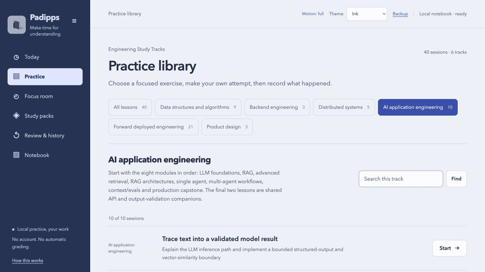
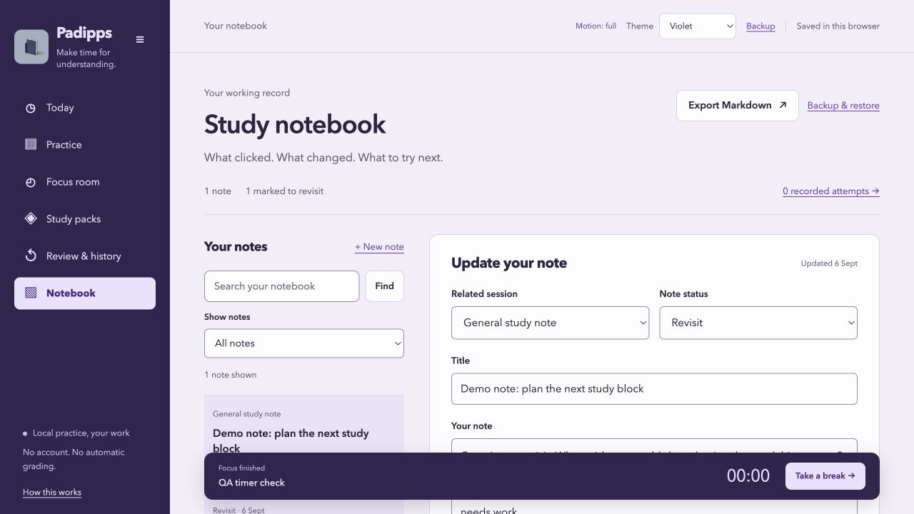
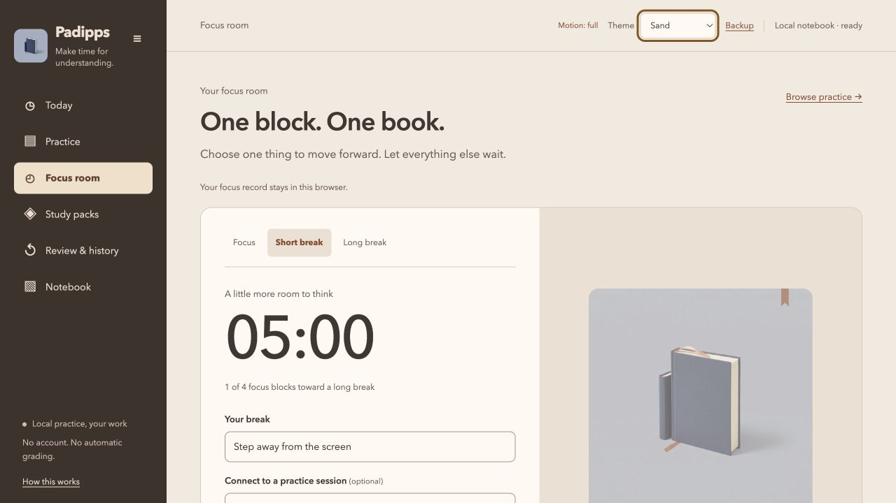
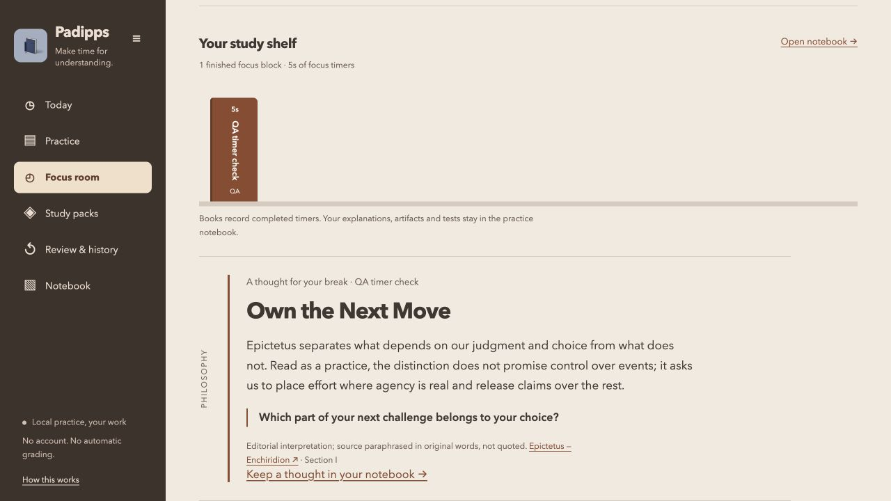

# Padipps

Padipps is a study app for practising concepts, keeping lesson notes and running Pomodoro sessions. Choose a lesson, explain the idea in your own words, do the independent exercise, and record what needs another attempt.

Your work stays in your browser. Optional tutoring connects to your own Codex account on your computer. The name is inspired by colloquial Tamil around studying.

[Try Padipps](https://siddath.github.io/padipps/) · [Study tracks](docs/STUDY_TRACKS.md) · [Create a pack](PACKS.md) · [Codex setup](docs/CODEX.md)



*The running app with the engineering pack selected. Screenshots use an isolated demo session; no personal study records or account details appear. [Capture details](docs/screenshots/README.md).*

## Features

| Feature | What you can do |
| --- | --- |
| Guided practice | Recognise the problem, work through a small model and trace, explain it back, then attempt an independent task. Record an outcome, evidence and a review date. |
| Study library | Start with three lessons or select the optional engineering pack: 40 lessons across six overlapping tracks, including an eight-module AI route and a Kafka consumer-lag lesson. Filter by track and search within it. |
| Notebook | Link notes to lessons, search them, mark them Open, Revisit or Resolved, and inspect up to 20 previous versions. Drafts save as you type. |
| Focus timer | Configure focus, short-break and long-break intervals. Pause, resume or reload without losing the timer. Start each interval yourself. |
| Study shelf | Reveal a book after a finished focus timer. Choose philosophy, art or spirituality ideas with source links and reflection questions, or turn ideas off. |
| Appearance | Choose Ink, Sand, Midnight, Violet, Rose or Graphite; collapse the sidebar; use GSAP transitions with system or manual reduced motion. |
| Lesson conversations | Use Explain, Quiz me or Check my understanding. Each lesson has saved messages and drafts, Stop/Retry, and Markdown/JSON conversation archives. In-app answers require the optional local Codex connection. |
| Portable study packs | Preview and import data-only JSON packs for your own subjects. Each pack revision keeps its own notebook, focus and conversation history. |
| Backups | Export notebook Markdown for an editor or Obsidian, restore notebook JSON, and export/restore focus records through their separate backup controls. |

Practice outcomes are self-reported. A completed timer records elapsed time; it does not establish attention or understanding. The app does not run learner code or grade mastery. Book ideas are editorial interpretations, with sources, rather than quotations.

<details>
<summary>More screenshots: AI route, notebook, focus timer and book reveal</summary>

**AI route, Ink theme.** Eight modules in order, followed by two shared API exercises.



**Notebook, Violet theme.** A sample note marked Revisit, with zero practice attempts recorded.



**Focus room, Sand theme.** A short break ready to start after a five-second QA timer.



**Study shelf, Sand theme.** The QA book opens a reflection on Epictetus with a source link. This is a test reward, not a learner achievement.



</details>

## Run locally

Requires Node.js 20 or newer. The study app needs no package installation.

```sh
git clone https://github.com/siddath/padipps.git
cd padipps
npm start
```

Open http://127.0.0.1:4177. Use `PORT=4178 npm start` if that port is busy. Chat is disabled by default.

The [hosted app](https://siddath.github.io/padipps/) supports practice, notes, focus and a copyable tutor prompt. It has no chat backend and cannot connect to your computer. To host your own copy, run `npm run build` and serve `dist/` over HTTP(S). Hash routes need no rewrite rules. There is no service worker; loading or reloading requires a reachable server.

## Choose your study material

Open **Study packs → Preview engineering pack → Use this pack**. The included tracks cover DSA, backend engineering, distributed systems, AI application engineering, forward deployed engineering/customer delivery and product design. Follow the [eight-module AI route](docs/AI_ROUTE.md) from LLM foundations through a production capstone. Kafka consumer lag belongs to Distributed systems. Some lessons belong to more than one track. See the [track guide](docs/STUDY_TRACKS.md) for counts, prerequisites and the fictional customer-delivery capstone, and [exercise materials](materials/engineering/) for unsolved starters.

The original three-lesson starter and [previous 31-lesson engineering pack](packs/engineering-v1.json) stay available. Switching packs preserves its records. To create another subject, download the current pack as a template, edit its JSON, then import and preview it before choosing **Use this pack**. [PACKS.md](PACKS.md) documents lesson fields, validation and extension rules.

Keep copies of the exact pack files you use. Backups belong to a pack ID and SHA-256 content fingerprint; even an editorial change creates a separate revision. Switching revisions does not merge histories. Import validation checks structure and safe links, not teaching accuracy.

## Connect your own Codex

On your computer, install the supported CLI and sign in, then enable the local adapter:

```sh
npm install -g @openai/codex@0.147.0
codex login
npm run chat
```

Open the printed local URL and choose **Ask Padipps Study**. Review the lesson context before sending. Your account supplies the connection and usage limits; Padipps includes no shared account or API key. Never enter credentials into the browser interface, a pack or an issue.

The adapter accepts CLI **0.147.0** and uses **GPT-5.6 Sol**. It isolates startup context and disables executable tools, global instructions, memories and connectors. macOS has live-model verification; Linux has synthetic boundary tests but no live-model verification in this release. Windows local chat is disabled. A separate supported CLI installation can avoid changing the version used by another project. See [setup, data flow and troubleshooting](docs/CODEX.md).

This conversation is local to Padipps; it does not sync with ChatGPT or Codex app tasks. Model answers can be wrong and do not update practice progress. Record assisted work as assisted.

## Keep your work

Browser storage is unencrypted and belongs to the current host, port and browser profile. Changing any of these does not transfer your records. Clearing browser data can remove them. Use an origin and browser profile you trust; there is no cloud sync or Padipps account.

Use **Backup** for notebook JSON and Markdown, and **Focus room → Focus record & backup** for focus JSON. Notebook restore preserves conflicting current entries. Export both versions before reconciling conflicting edits. JSON restores app state; Markdown fits a folder or Obsidian vault.

Chat retains the latest 80 messages per lesson and sends at most 12 recent whole messages within its context limit. Conversation exports are separate archives with no restore path. Only the selected lesson context and recent messages go to the optional tutor when you press Send. Other notes and files are not attached.

Keep private packs in the Git-ignored `private-packs/` or `local-packs/` folders and exports in `backups/`. The static build excludes those folders and the chat backend. Read [privacy and data flow](PRIVACY.md) before importing sensitive material or enabling tutoring.

## Contribute

The app uses browser ES modules, vendored GSAP and Node's built-in test runner. The package exports the pure study, focus, pack and reflection modules through `./study`, `./focus`, `./packs` and `./reflections`. Its `private: true` setting prevents accidental npm publication; the repository is public and MIT-licensed.

```sh
npm run check
npm test
npm run audit:publication -- --history
npm run build
```

Use a disposable port and `?qa#today` for interface checks. QA has separate record storage and a five-second timer; its entries are test data. GitHub Actions runs the checks and publishes the static asset allowlist from the default branch without model credentials.

Read [contribution guidance](CONTRIBUTING.md), [architecture](docs/ARCHITECTURE.md), [testing](docs/TESTING.md) and [security reporting](SECURITY.md). Pack authoring tools, accessible sound controls and opt-in sync are possible contributions, not features in this release.

## Contact and license

Contact [Siddath](mailto:siddath.raghavan@gmail.com) for general questions or collaboration. This address is intentionally public. Use the private channel in [SECURITY.md](SECURITY.md) for vulnerabilities.

Code and original educational writing use the [MIT license](LICENSE). GSAP has its own Standard License. [Third-party notices](THIRD_PARTY_LICENSES.md) cover animation, generated artwork and linked sources.
