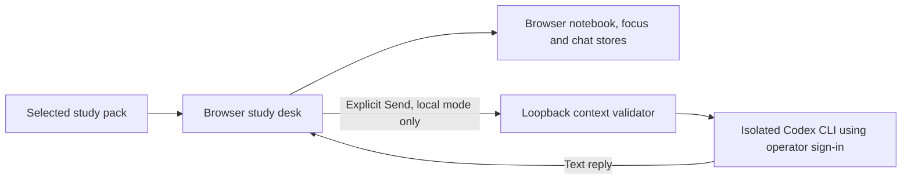

# Architecture

Padipps is a browser application with an optional local text tutor. Study packs are data; learner evidence, focus records and conversations remain independent. A static deployment includes no backend or authentication material.

## Modules

| Boundary | Modules |
| --- | --- |
| Authored/imported lesson data | `packs/`, `pack-engine.js`, `content.js`, `catalog.js`, `packs-ui.js` |
| Practice and notebook | `engine.js`, `backup-engine.js`, `notebook-ui.js`, `app.js` |
| Focus and appearance | `focus-engine.js`, `focus-ui.js`, `reflections.js`, `appearance.js`, `motion.js` |
| Conversation | `chat-context.js`, `chat-engine.js`, `chat-ui.js`, `chat.css` |
| Optional local connection | `server.mjs`, `chat-api.mjs`, `chat-provider.mjs` |
| Static publication | `public-assets.mjs`, `scripts/build.mjs`, GitHub Pages workflow |

Pack validation rejects unknown fields, unsafe identifiers and embedded URL credentials. A SHA-256 content fingerprint namespaces each revision's learner data. Changing a pack is an explicit user action; it does not merge old histories or prove new competence.

The tutor sees only a stage-aware field allowlist and recent messages. Its HTTP payload cannot choose a file, shell command, executable, model, credential or tool. The API bounds payloads, message lengths, concurrency, rate, time and output, and requires a same-origin browser request marker. The fixed provider revalidates the installed CLI, excludes startup context, disables executable capabilities and rejects unexpected events. Cancellation terminates the owned process group.

The public website and local study desk share browser code. On a static host the conversation has a manual-copy fallback; there is no cross-origin bridge to someone's computer. `npm start` keeps chat disabled. `npm run chat` explicitly enables the operator's local adapter.

## Extension boundaries

Add a subject as a validated pack and original materials; do not couple it to personal logs. Add another AI provider only behind the local server boundary, with explicit user setup, validation and failure-path tests. A hosted multi-user backend would require a separately designed authentication, authorization, quota and data-retention system; the current loopback service must not be exposed publicly.
