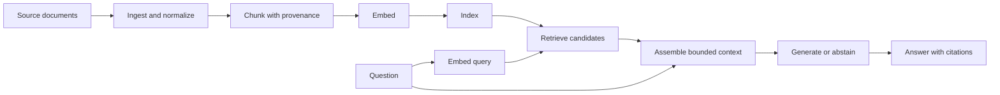

# Build and measure a first retrieval-augmented generation pipeline

This lesson starts where a plain language-model request stops. Model parameters are a lossy,
time-bounded result of training; they are not a current, queryable copy of every source. A model can
produce a plausible answer when a fact is absent, stale, ambiguous, or contradicted. Retrieval-
augmented generation (RAG) adds an explicit external evidence path. It can improve grounding and
freshness, but only when ingestion, retrieval, generation, and evaluation are each measured.

Complete `ai-llm-foundations` first. The guided segment fits one study block; the independent
LangChain and Chroma implementation can span several blocks. The corpus and questions here are
fictional. The starter is **unsolved**, includes no key, and records no live model or external source
integration as run.

## The two paths in RAG



The offline path ingests, chunks, embeds, and indexes documents. The online path embeds a question,
retrieves candidates, assembles context, and asks a generator to answer from that context. Source ID,
version, and chunk boundaries must survive the whole path so a citation can identify the evidence
actually supplied. Retrieval does not make an answer true; it gives the generator inspectable input.

## Knowledge freshness and hallucination boundaries

RAG is useful when facts change after model training, belong to a private or specialist corpus, or
need source-level evidence. It does not automatically solve:

- stale source synchronization or an index built from an obsolete version;
- a relevant document that chunking or retrieval misses;
- an irrelevant passage ranked highly by the embedding model;
- a generator that ignores, misreads, or overstates retrieved text;
- permissions, prompt injection, or fabricated citations.

Record source timestamps and versions, define an update policy, and let the system abstain when the
retrieved context does not support the question.

## Chunking is a retrieval design decision

Small chunks can isolate a precise fact but lose definitions, headings, and cross-sentence context.
Large chunks preserve context but can mix topics, consume the context window, and dilute the vector.
Overlap can keep boundary-spanning statements intact, while excessive overlap creates duplicates and
distorts evaluation. Choose from evidence:

| Choice | Useful when | Failure to test |
| --- | --- | --- |
| Fixed size with overlap | Plain prose and a quick baseline | Split clauses, duplicate hits |
| Heading-aware | Manuals and structured Markdown | Heading without its body |
| Semantic/topic-aware | Topic boundaries matter more than length | Unstable or expensive segmentation |
| Parent-child | Retrieve a precise child, return a broader parent | Parent exceeds context budget |
| Format-aware | Tables, code, lists, and transcripts | Structure destroyed during parsing |

Every chunk should retain a stable chunk ID, document ID, source version, and useful metadata. Test at
least one sentence that crosses the initial boundary.

## Embedding choice is part of the contract

Evaluate the actual query and document languages, domain vocabulary, input limits, vector dimension,
normalization, latency, deployment boundary, license, cost, and update policy. Query and document
vectors must share compatible geometry and dimensions. Switching models usually means re-embedding
the index. A tiny deterministic hash embedding is acceptable for wiring tests in this exercise; its
scores are not evidence of semantic retrieval quality.

## Index choices: HNSW, IVF, and PQ are not synonyms

- **HNSW** is a graph-based approximate nearest-neighbor index. Search walks a layered proximity
  graph. More links and a deeper search can improve recall at the cost of memory, build time, or
  latency. It commonly keeps full vectors unless combined with separate quantization.
- **IVF** partitions vectors into coarse cells and searches selected inverted lists. More probed
  cells can improve recall while increasing work. The coarse quantizer must be trained on a
  representative sample.
- **PQ** is vector compression. It splits vectors into subvectors and stores compact codebook indices,
  reducing memory at the cost of distance approximation and possible recall loss. PQ can be used by
  itself or combined with IVF; it is not another name for IVF.

Always compare an approximate index against an exact flat-search baseline on held-out queries. Tune
recall, latency, memory, build cost, update behavior, and deletion needs together.

## Generation and citations

Pass the question and only the selected chunks to a bounded generator. Require an answer schema such
as `{text, citations}`. Each citation should carry the exact document ID, version, and chunk ID used.
Validate that cited IDs occurred in the supplied context. Then manually inspect whether the cited span
actually supports the claim; reference validity alone does not prove entailment.

The required assignment may use a deterministic local generator or a learner-supplied callable. An
optional model integration belongs to an environment you install and control. Do not add a key or
claim a live evaluation unless you run and record it.

## Independent assignment — LangChain + ChromaDB

Implement every TODO in `rag_pipeline.py` using LangChain's `Document` and the `langchain-chroma`
`Chroma` vector store.

1. Load `fixtures/corpus.json` and reject duplicate IDs, blank text, or missing version/title.
2. Implement a fixed-size character chunker with overlap as the measured baseline. Preserve document
   ID, version, title, and stable chunk ordinal in metadata. Add one boundary-spanning test.
3. Implement a deterministic local embedding adapter for wiring. It must return equal-length,
   non-zero vectors and must not be described as semantically good.
4. Create a local Chroma collection with that embedding adapter, add the chunks, and retrieve top-k
   candidates for every question in `fixtures/eval_questions.json`.
5. Implement answer assembly through a passed-in `generator(question, contexts)` callable. Require
   citations to context IDs and abstain on unsupported or empty context. Keep any provider adapter
   outside the required path.
6. Measure retrieval precision@k, recall@k, and reciprocal rank against `expected_source_ids`. Report
   per-question rows and aggregate numerators/denominators. Do not invent a gain.
7. Compare two chunk configurations and one retrieval `k`. Keep the evaluation questions held out
   from design changes after the baseline is frozen.

Install framework packages only in an environment you own. Consult the current project docs before
choosing versions; this repository does not install or pin them for you.

```sh
python3 -m venv .venv
# Activate the environment, then choose and record current compatible versions.
python3 -m pip install langchain-chroma chromadb
python3 -B -m unittest -v test_rag_pipeline
```

The initial tests exit nonzero with TODO errors. They cover local input, chunk, citation, and metric
contracts. They do not prove Chroma persistence, ANN quality, a live embedding model, or generation
quality; add and record those checks when you actually run them.

## Evidence to record

Record exact dependency versions, corpus fingerprint, chunk policy, embedding identity, collection
configuration, per-question retrieved IDs, metric denominators, command output, one unsupported
question, one citation-support review, and remaining failure cases. Keep baseline and variants in the
same table even if every variant is worse.

## Primary sources

- [Retrieval-Augmented Generation for Knowledge-Intensive NLP Tasks](https://arxiv.org/abs/2005.11401)
- [LangChain Chroma integration](https://docs.langchain.com/oss/python/integrations/vectorstores/chroma)
- [Chroma query and get](https://docs.trychroma.com/docs/querying-collections/query-and-get)
- [Chroma embedding functions](https://docs.trychroma.com/docs/embeddings/embedding-functions)
- [Faiss index selection guidance](https://github.com/facebookresearch/faiss/wiki/Guidelines-to-choose-an-index)
- [HNSW paper](https://arxiv.org/abs/1603.09320)

